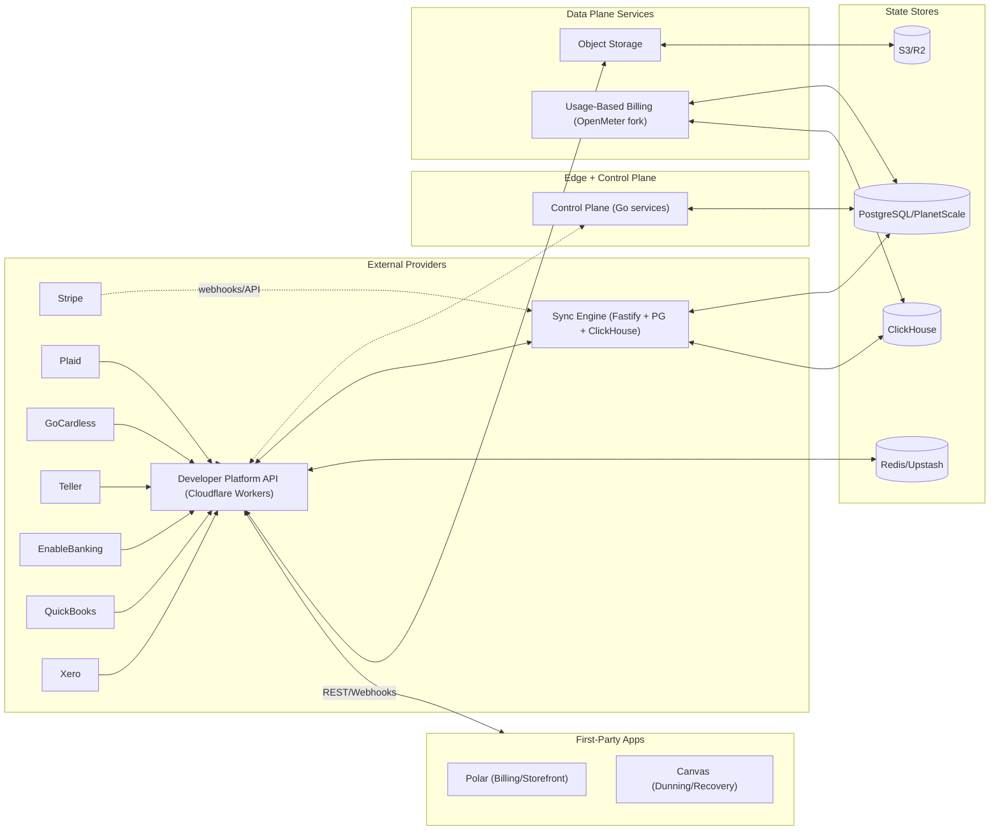
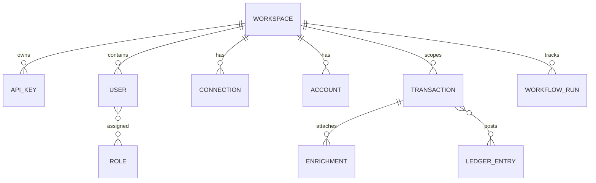
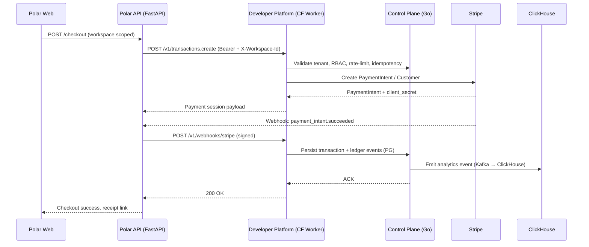
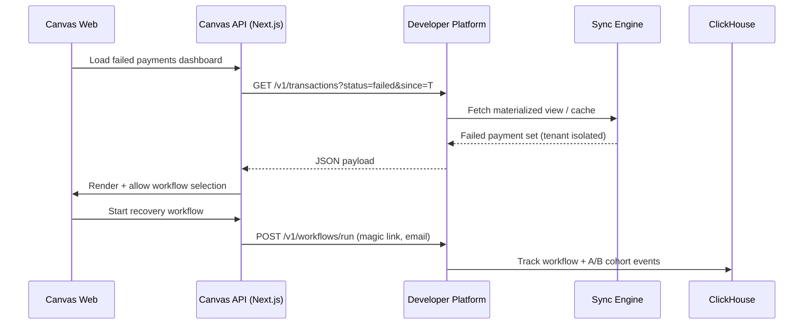
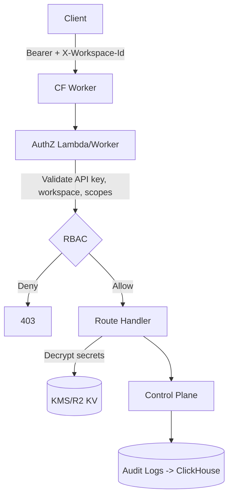
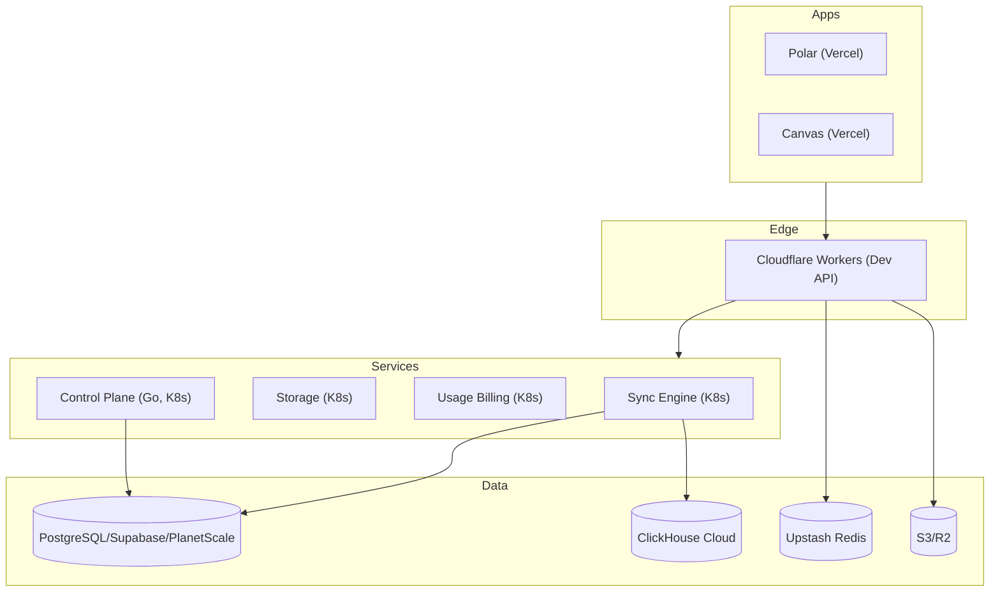

# RFC: Oppulence Platform Architecture

> Revenue Operations OS — unified financial data plane and application suite for SMB SaaS companies.

| Field | Value |
|-------|-------|
| Status | Draft (living) |
| Drivers | Platform Team |
| Reviewers | Infra + App Leads |
| Created | 2024-11 |
| Last Updated | 2024-11 |

## 1) Problem & Goals

Modern SaaS vendors need a consolidated revenue stack: ingest multi-provider financial signals, enforce controls, enrich with AI, and expose a programmable surface that powers first-/third-party apps. Oppulence delivers:

- A **developer platform** (financial data plane + control plane APIs) with first-class multi-tenancy, RBAC, rate limiting, idempotency, and caching.
- **First-party apps** (Polar billing, Canvas recovery) built on the same platform APIs.
- **Data/infra services** (sync, storage, usage-based billing) providing durable pipelines, observability, and replayability.

Non-goals: pricing/packaging, UX copy, commercial SLAs (covered elsewhere).

## 2) System Context (C4 Level 1)



## 3) Component Inventory (C4 Level 2)

| Repository | Layer | Responsibilities | Primary Stack |
|------------|-------|------------------|---------------|
| `oppulence-developer-platform` | Platform | Edge API (REST), control plane (RBAC, tenancy, rate limiting), financial engine, enrichment, idempotency, secrets, provider adapters | Cloudflare Workers (Hono/TypeScript), Go services, MySQL/PlanetScale, Redis, ClickHouse |
| `oppulence` | App | Billing, checkout, invoicing, customer portal, pricing pages, subscription lifecycle, receipts | FastAPI + SQLAlchemy, Next.js, PostgreSQL, Redis + Dramatiq |
| `oppulence-canvas` | App | Dunning, recovery workflows, magic links, email sequences, analytics with holdouts | Next.js 16 + React 19, Supabase (PostgreSQL), Graphile Worker, Drizzle |
| `oppulence-sync-engine` | Infra | Stripe webhook ingestion, dual-write PG/ClickHouse, replay/backfill, DLQ | Fastify + TypeScript, Prisma, PostgreSQL, ClickHouse, Graphile Worker |
| `oppulence-storage` | Infra | Multi-tenant object storage, signed URLs, lifecycle policies | Fastify + TypeScript, S3/R2 |
| `oppulence-usage-based-billing` | Infra | Meter ingestion, aggregation windows, billing export | Go, Kafka, ClickHouse |

## 4) Domain & Data Model (C4 Level 3)



- **Tenancy**: `workspace_id` on every row; RLS enforced in PG/CH; Redis keys namespace-prefixed; S3 paths include workspace prefix.
- **Identity/RBAC**: WorkOS/NextAuth → workspace membership → role policy (Owner/Admin/Member/Service) enforced in control plane.
- **Idempotency**: `Idempotency-Key` header hashed per workspace + route; stored with TTL in Redis; replay-safe for POST/PUT/PATCH.
- **Eventing**: Ledger/event bus emits to ClickHouse via Kafka pipeline for analytics, replay, and reconciliation.

## 5) Request Lifecycles (C4 Level 3/4)

### 5.1 Checkout + Billing + Ledger (Polar → Platform → Stripe)



### 5.2 Recovery Flow (Canvas → Platform → Sync Engine)



### 5.3 Data Ingestion (Stripe Webhook → Sync Engine → Platform)

```mermaid
sequenceDiagram
  participant Stripe as Stripe
  participant SyncAPI as Sync Engine (Fastify)
  participant Worker as Worker (Graphile)
  participant PG as PostgreSQL
  participant CH as ClickHouse
  participant DevAPI as Developer Platform

  Stripe-->>SyncAPI: Webhook event (signed)
  SyncAPI->>PG: Upsert raw + normalized records (tenant key)
  SyncAPI->>Worker: Enqueue fan-out jobs (idempotent key)
  Worker->>PG: Backfill/retry with exponential backoff
  Worker->>CH: Dual-write analytics projection
  Worker->>DevAPI: Internal POST /v1/webhooks/stripe (tenant-scoped)
  DevAPI->>Redis: Invalidate caches; refresh materialized views
```

## 6) API Surface (selected, workspace-scoped)

- `POST /v1/connections` — create provider connection; stores encrypted credentials; returns connection id.
- `GET /v1/transactions` — list transactions with enrichment toggles; supports incremental `since` cursor.
- `POST /v1/transactions.sync` — initiate backfill/sync job; rate-limited per workspace.
- `POST /v1/enrichment` — AI enrichment for merchant/category/purpose/recurrence.
- `GET /v1/accounts` — accounts with balances and institution metadata.
- `POST /v1/webhooks/stripe` — signed ingestion from Sync Engine or Stripe direct.
- `POST /v1/workflows/run` — trigger recovery workflow (Canvas).
- `GET /v1/ledger` — ledger entries by workspace, immutable.

## 7) Security, Auth, and Compliance Controls



- **API Auth**: Workspace-scoped API keys (HMAC). Rotation via control plane; keys hashed at rest.
- **Provider Secrets**: Encrypted at rest (KMS/R2-KV); decrypted per request in edge runtime; scoped to workspace.
- **Transport**: TLS everywhere; webhook signatures verified (Stripe, Plaid, GoCardless, Teller).
- **RBAC**: Policy matrix per route; service keys separated from user keys; audit log for privilege changes and key rotation.
- **PII Handling**: Tokenized provider identifiers; log minimization; ClickHouse restricted views; access via scoped roles.
- **Compliance Posture**: SOC2 alignment; auditable events for auth, payouts, connection changes, workflow edits.

## 8) Reliability, Performance, and Observability

- **SLOs (targets)**: p99 latency < 400ms (edge API); ingestion lag < 30s; webhook success > 99.9%; checkout availability > 99.9%.
- **Idempotency & Retry**: Stripe webhook ingestion idempotent via event/tenant key; exponential backoff with jitter; DLQ + replay CLI; ledger writes immutable with compensating events.
- **Caching**: Redis per-tenant caches for accounts/transactions; TTL 30–120s; stampede protection via singleflight; cache bust on writes/webhooks.
- **Rate Limiting**: Sliding window per workspace and per API key; burst tokens for backfill endpoints; header exposure for remaining quota.
- **Health**: `/healthz` and `/readyz` per service; synthetic checks for checkout, enrichment, webhook ingress; circuit breakers per provider adapter.
- **Telemetry**: OpenTelemetry traces (edge → control plane → sync engine); metrics to Prometheus/Grafana; logs to Loki; ClickHouse for product analytics.

## 9) Deployment & Environments



- **Environments**: dev (shared), staging (prod-like with masked data), prod (isolated). Feature flags via LaunchDarkly/Envoy filters.
- **CI/CD**: GitHub Actions → lint/test → build → deploy; infra via Helm + Terraform (`oppulence-infrastructure-as-code`).
- **Secrets**: Cloudflare Secrets, Kubernetes Secrets (sealed), R2 KV for provider tokens; short-lived tokens for internal service calls.

## 10) Failure Modes & Mitigations

- Provider outage (Stripe/Plaid): circuit breakers per adapter; cached reads; webhook backlog queued with backoff; replay tooling.
- ClickHouse unavailability: OLTP writes continue; analytics events buffered for replay; CH writers paused to avoid partials.
- Redis outage: fall back to direct DB reads; conservative rate limiting to prevent false throttling; disable cache-mandatory paths.
- Webhook spikes: autoscale Sync Engine; bounded queues; DLQ + replay CLI; shard by workspace id.
- Partial writes: dual-write guardrails (PG primary); compensating ledger events for rollback/void flows; idempotent ledger append.

## 11) Data Platform Notes

- **ClickHouse**: Fact tables for transactions, ledger events, workflow events; materialized views per workspace; TTL for raw ingestion; S3-backed parts where applicable.
- **PostgreSQL/PlanetScale**: Authoritative OLTP for tenants, connections, keys; strict FK + RLS; partitioning by workspace id for large tables.
- **Kafka (OpenMeter)**: Meter ingestion → window aggregations → billing exports to Polar; backpressure-aware consumers.
- **Storage**: R2/S3 for receipts, invoices, attachments; signed URLs; lifecycle policies (90d cold storage); per-tenant prefixes.

## 12) Operational Runbooks (pointers)

- Webhook replay: `oppulence-sync-engine` worker CLI with tenant + event id filters.
- Cache flush: per-workspace Redis namespace eviction triggered via control plane admin endpoint.
- Key rotation: rotate workspace keys via control plane; propagate to Workers KV; audit in ClickHouse.
- Backfill: `/v1/transactions.sync` with rate-limited windows; monitor ingestion lag dashboards.

## 13) Repository Pointers

- Platform: `oppulence-developer-platform/apps/api` (edge API), `apps/financial-engine-api`, `go/` (control plane), `internal/` (shared packages).
- Polar: `oppulence/server/polar`, `clients/apps/web`, `server/migrations`.
- Canvas: `oppulence-canvas/apps/web`, `packages/engine`, `packages/worker`, `packages/db`.
- Sync Engine: `oppulence-sync-engine/packages/fastify-app`, `packages/sync-engine`, `packages/worker`.
- Storage: `oppulence-storage/apps/api`.
- Usage Billing: `oppulence-usage-based-billing/` (OpenMeter fork).

## 14) Open Items

- Formalize SLAs/SLO error budgets per route and publish dashboards.
- Expand provider matrix (QuickBooks/Xero read/write parity).
- Add privacy threat model and DLP checks for enrichment logs.
- Define RPO/RTO and DR runbook per environment.

## 15) Quick Links

| Repository | Purpose | Docs |
|------------|---------|------|
| [oppulence-developer-platform](https://github.com/Oppulence-Engineering/oppulence-developer-platform) | Unified Financial API | [RFCs](https://github.com/Oppulence-Engineering/oppulence-developer-platform/tree/main/docs/rfcs) |
| [oppulence](https://github.com/Oppulence-Engineering/oppulence) | Billing/Storefront | [README](https://github.com/Oppulence-Engineering/oppulence/blob/main/README.md) |
| [oppulence-canvas](https://github.com/Oppulence-Engineering/oppulence-canvas) | Dunning/Recovery | [README](https://github.com/Oppulence-Engineering/oppulence-canvas/blob/main/README.md) |
| [oppulence-sync-engine](https://github.com/Oppulence-Engineering/oppulence-sync-engine) | Stripe Data Sync | [README](https://github.com/Oppulence-Engineering/oppulence-sync-engine/blob/main/README.md) |
| [oppulence-storage](https://github.com/Oppulence-Engineering/oppulence-storage) | Object Storage | [README](https://github.com/Oppulence-Engineering/oppulence-storage/blob/main/README.md) |
| [oppulence-usage-based-billing](https://github.com/Oppulence-Engineering/oppulence-usaged-based-billing) | Usage Metering | [README](https://github.com/Oppulence-Engineering/oppulence-usaged-based-billing/blob/main/README.md) |

---

*This RFC is source-of-truth; update alongside system changes.*
